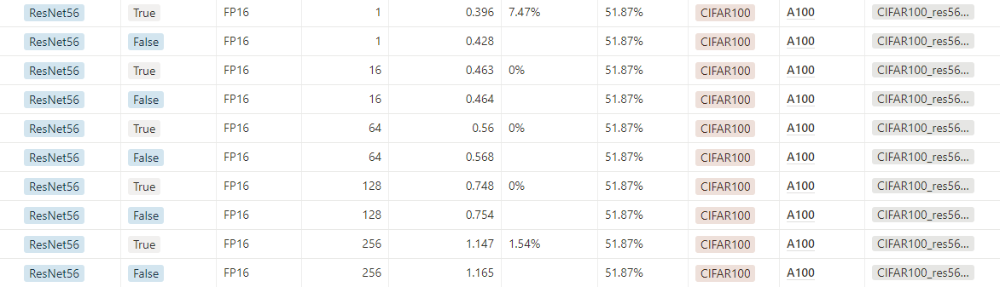

# Getting Started

To get started with weight_pruning_A100-A6000, follow these steps.

## Step 1. Install Dependencies

```
$ docker pull whdlsghks/a100_a6000:1.0
#$ docker run ...
$ git clone https://github.com/InhwanCho/Weight-pruning_A100-A6000.git
$ cd main/

# or

$ git clone https://github.com/InhwanCho/Weight-pruning_A100-A6000.git
$ cd main/
$ docker pull nvcr.io/nvidia/tensorrt:23.03-py3
#$ docker run ...
$ pip install -r requirements.txt
```

## Step 2. Pruning M:N Sparsity
```
# please change the folder&file_name first
# origin code : [https://github.com/pytorch/examples/tree/main/imagenet]

$ python Cifar100_train_main.py 

# ImageNet / ResNet(50/101/152...)
$ python resnet_training_main.py --MNmode --ONNX=$$$$$.onnx --pretrained=true --arch resnet50
$ python resnet_training_main.py --MNmode --ONNX=$$$$$.onnx --pretrained=true --arch resnet101
$ python resnet_training_main.py --MNmode --ONNX=$$$$$.onnx --pretrained=true --arch resnet152

#CIFAR100 / ResNet56(only)
$ python CIFAR100_training_main.py
```

## Step 3. Converting onnx to trt_engine
```
# build engine
# if you are using CIFAR100 put '--CIFAR100' option
$ python onnx2trt.py --trtFile=$$$$$.trt --onnxFile=$$$$$.onnx --max_batch=256 --Sparsity

# checking the accuracy
$ python trt_accuracy.py --trtFile=$$$$$.trt

# measure the latency
$ python trt_inference.py --trtFile=$$$$$.trt --batch_size=1 --Sparsity
```

### to convert many trt_engine
```
# set the sh file(sample)
$ sed -i -e 's/\r$//' auto_python.sh
$ vim auto_python.sh
```

## Usage for onnx2trt & trt_accuracy & trt_inference
```
    python onnx2trt.py [--trtFile trtfile] [--onnxFile onnxfile]
             [--pthFile pthfile] [--batch_size batchsize_for_inference]
             [--opt_batch optimal_batchsize_for_set_trtengine_shaep]
             [--maxbatch max_batchsize_for_set_trtengine_shaep]
             [--Sparsity] # Sparsity Enable option default=True
             [--NotUseFP16Mode] # Convert TF32 to FP16
             [--CIFAR100] # dataset=CIFAR100/ default = IMAGENET
```


- caution
when you measure inference time, you are not supposed to use sh file and you should execute `trt_inference.py`file with some break time
<br>
when you have CUDA version matching error, please import torch after import tensorrt(build/ load engine first)


<details>
<summary>show the result tables and summary</summary>
<div markdown="1">

A100 table


<br>
<br>
RTX-A6000 table


<br>

summary graph


<br>

tf32 table


</div>
</details>

<details>
<summary>### Refences ###</summary>
<div markdown="1">
    
[Notion link in detail](https://www.notion.so/keti-via/NPU-Weight-pruning-A100-A6000-Latency-2518e742b26e47e88b79ed9abac98166)

M:N sparsity Technical blog, NVIDIA 공식 문서 1,공식 문서 2 

[Accelerating Inference with Sparsity Using the NVIDIA Ampere Architecture and NVIDIA TensorRT | NVIDIA Technical Blog](https://developer.nvidia.com/blog/accelerating-inference-with-sparsity-using-ampere-and-tensorrt/)

[NVIDIA tensorRT](https://docs.nvidia.com/deeplearning/tensorrt/api/index.html)

[IExecutionContext — NVIDIA TensorRT Standard Python API Documentation 8.6.0 documentation](https://docs.nvidia.com/deeplearning/tensorrt/api/python_api/infer/Core/ExecutionContext.html#tensorrt.IExecutionContext.execute_async_v3)


- 코드 참고용 tnsorRT, 최신 버전 TensorRT 예제, MN spartsity(pruning)

[NVIDIA/TensorRT](https://github.com/NVIDIA/TensorRT)

[NVIDIA/trt-samples-for-hackathon-cn](https://github.com/NVIDIA/trt-samples-for-hackathon-cn)

[NVIDIA/apex](https://github.com/NVIDIA/apex)

- NM-sparsity/ trt엔진 상세 분석/ 논문리뷰

[TensorRT 코드 참고](https://github.com/aojunzz/NM-sparsity)
    
[TensorRT 분석](https://velog.io/@sjj995/TensorRT-Polygraphy를-활용하여-간단하게-trt-engine-추론-과정-알아보기)

[Acceleration sparse DNN 논문 리뷰](https://moon-walker.medium.com/리뷰-accelerating-sparse-deep-neural-networks-870b88c0e2bc)
    
</div>
</details>
